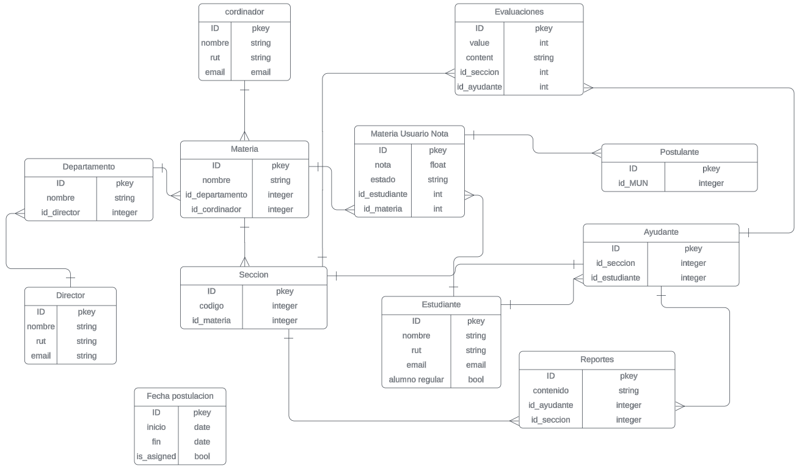

# Backend sistema de gestion de ayudantias

## Requerimientos

-   Python3.10+
-   Docker
-   MongoDB

## Iniciar proyecto

1. Crear a venv

```bash
python3 -m venv ./venv
```

2. Activar entorno venv

```bash
source ./venv/bin/active || source ./venv/bin/activate
```

3. Instalar dependencias

```bash
pip3 install -r requirements.txt
```

4. Correr

```bash
sudo docker compose up app --attach app
```

5. Inicializar base de datos

La creacion de la base de datos se realiza segun los modelos y `alembic` para generar las migraciones.

Genera la migracion de manera automatica

```
alembic revision --autogenerate
```

Aplica la migración en la base de datos

```
alembic upgrade head
```

## Docker

`Dockerfile.dev`
`Dockerfile.prod`

Puerto expuesto (en ambos Dockerfiles): `6060`

## API Reference (Swagger)

#### Swagger ui

```
  GET /api/v1/docs
```

#### Redoc

```
  GET /api/v1/redoc
```

## Recomendaciones



Se recomienda adaptar el sistema de gestion de ayudantias con la base de datos de la Universidad Tecnologica Metropolitana, para una integracion correcta y funcionamiento eficiente.
